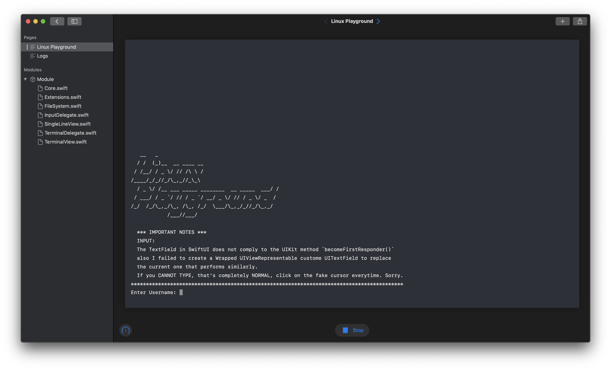
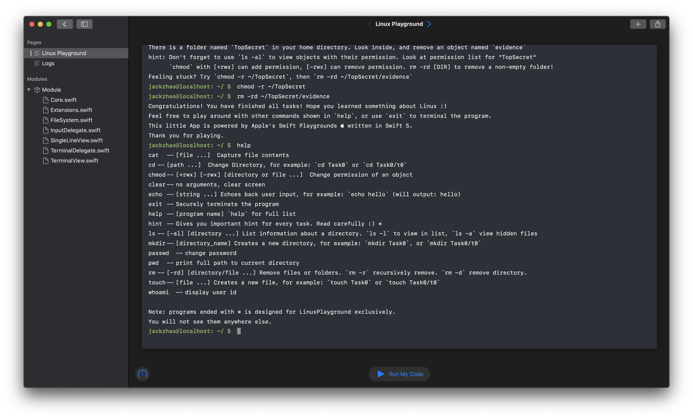
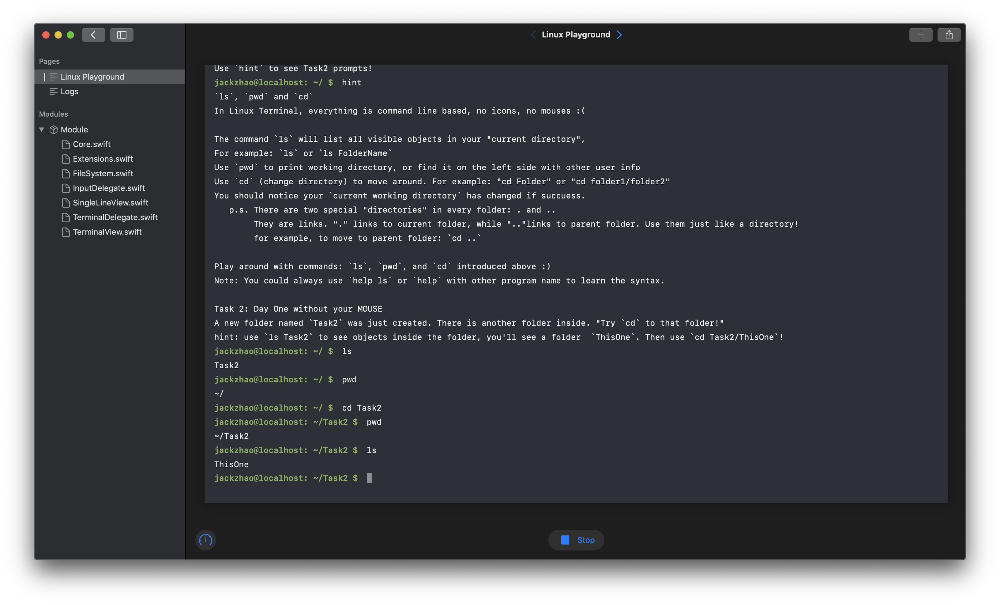
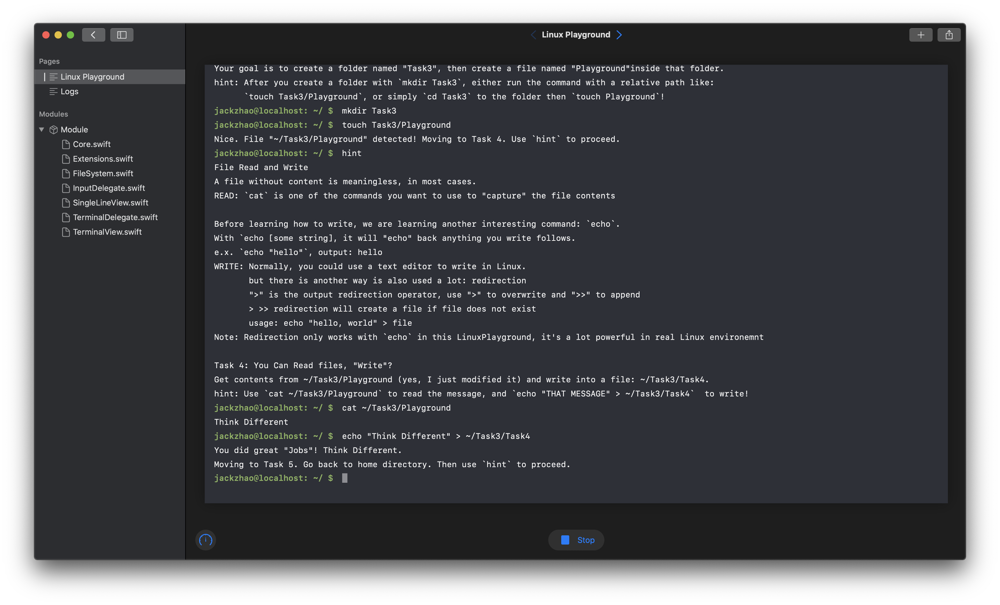
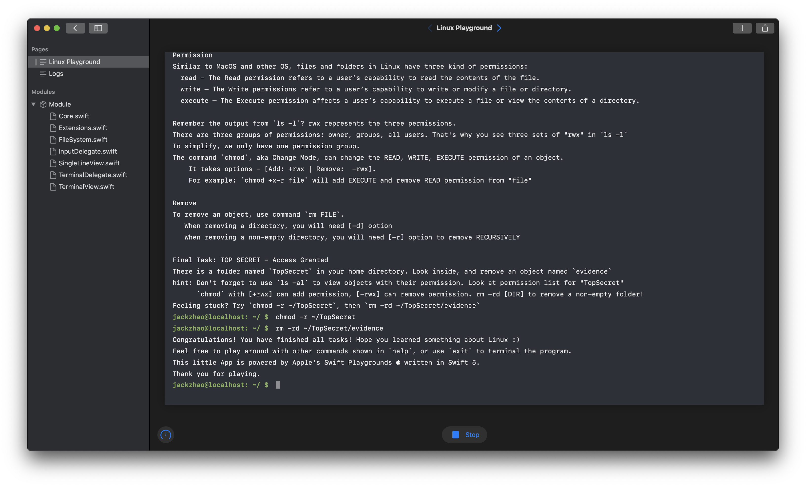

# Linux Playground
### [Apple WWDC 2020 Swift Student Challenge](https://developer.apple.com/wwdc20/swift-student-challenge/) (Accepted)

***Note:** Sadly, this playground no longer works on the latest version of SwiftPlayground for unknown reason, a better iOS/MacOS version is ongoing, stay tuned!*

## Insights
The idea of my project - LinuxPlayground, was inspired by Apple's Swift Playground. Similarly, I wish to build an interactive learning environment for Linux beginners, allowing starters to learn from exercise, with supervision and guidance, rather than throwing a pile of GNU Linux manuals to beginners and ask them to do tasks in Linux they have never done before. 

To reach that goal, I used TextField and Text in Apple's innovative way of UI deployment, `SwiftUI` to simulate a "virtual Linux terminal" environment for user to learn Linux shell and to play with. 

There are two major parts of the source code: view controller classes, and the Shell commands processing classes which handles user input, then outputs something in return. SwiftUI makes me easily deploy my Swift Playground on any device. However, SwiftUI is not yet a UIKit replacement all-round by this moment. There are many features that are not yet built into SwiftUI objects, one hardship I have encountered was to make TextField always the first responder. I have tried to wrap a UITextField object with `.becomeFirstResponder()` being called when the `textFieldDidEndEditing(:)` is called, but still the outcome is not well as expected. So unfortunately, I have to switch back to the default TextField, force user to click on the TextField before every input, leaving a really important problem on my TO-DO list. 

For the Shell command I/O delegate, I simulate the behavior of Linux shell program with a function, some of them supports flag options `[-abc]` and even file redirection for `echo`. The way I simulates the UNIX file system behavior is to create an N-ary tree data structure, then treat files and folders as abstract objects named `node`. Every node knows its children nodes (if it is a directory type) and its parent node. That could link files and directories just like a real file system. 

## A few screenshots
#### Initialize

#### Help - list of all commands

#### Task 1 in progress

#### Task 3 in progress

#### Final Task in progress

